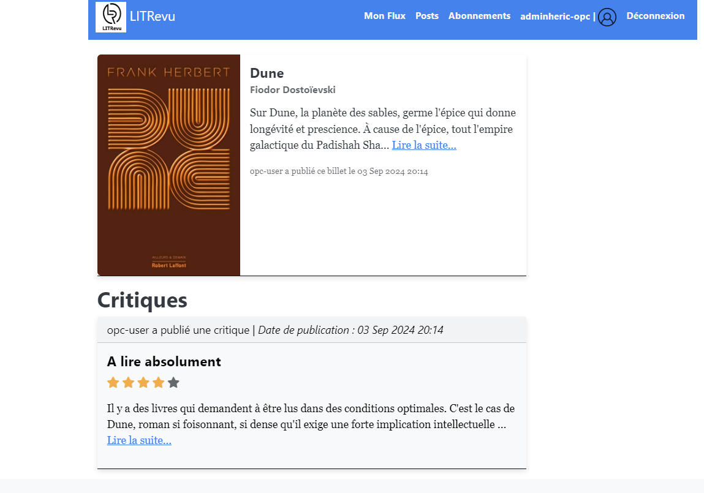

# LitRevu

LitRevu est une application Django qui permet aux utilisateurs de demander ou de publier des critiques de livres ou d’articles. Elle propose trois cas d’utilisation principaux :

1. Publication de critiques de livres ou d’articles.
2. Demande de critiques sur un livre ou un article particulier.
3. Recherche d’articles et de livres intéressants à lire, basés sur les critiques des autres utilisateurs.

## Fonctionnalités

- **Création de billets** : Les utilisateurs peuvent créer des billets pour demander une critique d'un livre ou d'un article.
- **Publication de critiques** : Les utilisateurs peuvent publier des critiques en réponse aux billets ou créer des critiques de manière indépendante.
- **Gestion des utilisateurs suivis** : Les utilisateurs peuvent suivre d'autres utilisateurs pour voir leurs publications dans leur flux personnalisé.
- **Flux personnalisé** : Chaque utilisateur connecté peut voir un flux ordonné par date de publication, contenant les billets et critiques des utilisateurs qu'il suit, ainsi que ses propres publications.

## Prérequis

- **Python** : Version 3.10 ou supérieure
- **Django** : Version compatible avec Python 3.10+

## Installation

1. **Cloner le dépôt**

   ```
   git clone https://github.com/hericlibong/Web_Django_App_LitRevu.git
   cd Web_Django_App_LitRevu
    ```

2. **Créer l'environnement virtuel**

    ```
    python -m venv venv
    source env/bin/activate  # Sur Windows : env\Scripts\activate
    ```

3. **Installer les dépendances**

    ```
    pip install -r requirements.txt
    ```


4. **Utilisation de la base de données**
Vous n'avez pas besoin de migrer la base de données, car un fichier db.sqlite3 avec des données de démonstration est déjà inclus dans le projet.

## Configuration du fichier `.env`

### Préparer le fichier de configuration
- Localisez le fichier `.env.sample` dans le dossier principal du projet.
- Copiez ce fichier et renommez la copie en `.env` pour commencer la configuration de votre environnement.

### Modifier le fichier `.env`
- Ouvrez le fichier `.env` avec un éditeur de texte.
- Remplacez `your_secret_key_here` par une clé secrète Django forte et unique.
    - #### Générer une clé secrète Django
        - Vous pouvez générer une clé secrète en utilisant un outil en ligne ou en exécutant un script Python pour générer des clés sécurisées.
        - via des outils en ligne tels que [Djecrety](https://djecrety.ir/). Ce site fournit une clé secrète Django sécurisée que vous pouvez simplement copier et coller dans votre fichier `.env`.
         

- Assurez-vous que les valeurs des autres variables comme `DEBUG` et `ALLOWED_HOSTS` sont appropriées pour votre environnement de développement.

### Sauvegarder les modifications
- Enregistrez le fichier `.env` après avoir fait les modifications nécessaires.
- Ce fichier ne doit pas être ajouté à votre dépôt git, assurez-vous qu'il est listé dans votre `.gitignore` pour éviter toute exposition accidentelle de vos configurations.

## Lancer l'application

Une fois le fichier `.env` configuré, suivez les instructions pour activer votre environnement virtuel, installer les dépendances, et démarrer le serveur de développement.

1. **Lancer le serveur**
Depuis le dossier `src`, lancez le serveur de développement :


    ```
    cd src
    python manage.py runserver
    ```


2. **Accéder à l'application**

Ouvrez votre navigateur et accédez à http://127.0.0.1:8000/ pour utiliser l'application.

3. **Tester l'application**

Vous pouvez tester l'application avec un accès  déjà configuré :

    Nom d'utilisateur : opc-user
    Mot de passe : demo
    

